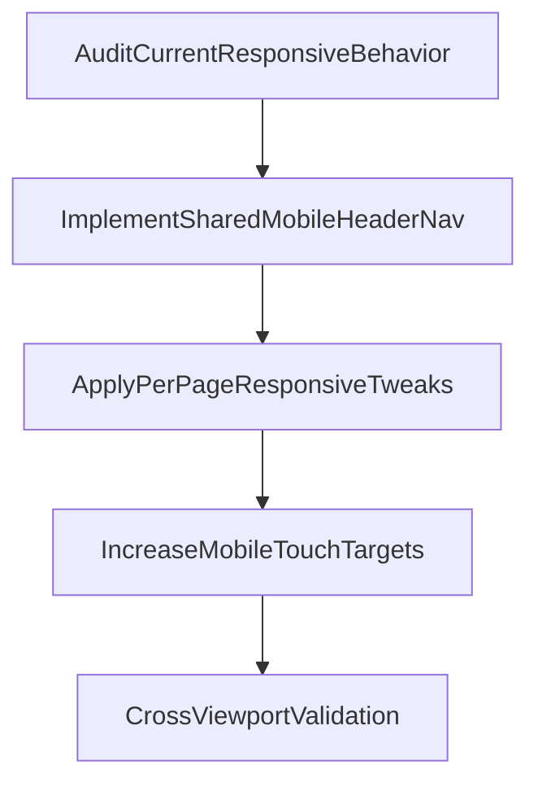

# Mobile Responsiveness Improvement Plan

## Scope And Goals

- Target pages:
  - [src/app/(home)/page.tsx](</home/ausath/Projects/openblog/src/app/(home)/page.tsx>)
  - [src/app/(home)/explore/page.tsx](</home/ausath/Projects/openblog/src/app/(home)/explore/page.tsx>)
  - [src/app/(article)/u/[username]/page.tsx](</home/ausath/Projects/openblog/src/app/(article)/u/[username]/page.tsx>)
  - [src/app/(home)/profile/page.tsx](</home/ausath/Projects/openblog/src/app/(home)/profile/page.tsx>)
  - [src/app/(article)/editor/[publicId]/page.tsx](</home/ausath/Projects/openblog/src/app/(article)/editor/[publicId]/page.tsx>)
- Include adjacent shared components that drive layout/interaction on those pages.
- Ensure mobile touch targets are at least 44px where practical, without regressing desktop density.

## Implementation Strategy

## 1) Shared Header And Navigation (Primary)

- Update [src/app/(home)/layout.tsx](</home/ausath/Projects/openblog/src/app/(home)/layout.tsx>) to introduce a dedicated mobile nav path using **shadcn `Sheet`** (single overlay choice).
- Add a new component (for example under [src/app/(home)/components/](</home/ausath/Projects/openblog/src/app/(home)/_components/>)) for mobile header actions:
  - Keep brand + primary action visible.
  - Move secondary nav/auth links into `Sheet` content.
  - Keep keyboard/accessibility semantics (`SheetTitle`, focus behavior, button labels).
- Keep desktop nav unchanged behind responsive breakpoints (`sm`/`md` visibility toggles).

## 2) Page-Specific Responsive Fixes

- Home and Explore pages:
  - Verify the issue is header-driven; keep page body mostly unchanged unless overflow is reproduced.
- Explore authors tab:
  - Update authors result grid in [src/app/(home)/explore/page.tsx](</home/ausath/Projects/openblog/src/app/(home)/explore/page.tsx>) from fixed two columns to responsive columns (mobile single-column, larger screens two-column).
  - Add defensive text truncation/container constraints for long names.
- Public user page:
  - Re-check spacing and content width in [src/app/(article)/u/[username]/page.tsx](</home/ausath/Projects/openblog/src/app/(article)/u/[username]/page.tsx>) for narrow devices.
- Profile page:
  - Keep header updates from shared `(home)` layout.
  - Adjust article list row actions in [src/app/(home)/components/article-actions.tsx](</home/ausath/Projects/openblog/src/app/(home)/_components/article-actions.tsx>) to meet mobile tap target goals (>=44px effective target).
- Editor page:
  - In [src/app/(article)/components/article-editor.tsx](</home/ausath/Projects/openblog/src/app/(article)/_components/article-editor.tsx>), hide fixed “Last saved…” status on mobile and keep it on larger breakpoints.
  - In [src/app/(article)/components/header.tsx](</home/ausath/Projects/openblog/src/app/(article)/_components/header.tsx>), hide header title on mobile to prevent overlap and hide the “Back” text label (icon-only on mobile).

## 3) Additional Areas Not Explicitly Listed (Preventative)

- Review and tune shared interactive primitives impacting these pages:
  - [src/components/ui/button.tsx](/home/ausath/Projects/openblog/src/components/ui/button.tsx) (small/icon variants used in header/actions)
  - [src/components/ui/dropdown-menu.tsx](/home/ausath/Projects/openblog/src/components/ui/dropdown-menu.tsx) (menu row density)
  - [src/components/ui/pagination.tsx](/home/ausath/Projects/openblog/src/components/ui/pagination.tsx) (crowding on narrow widths)
- Apply minimal, targeted responsive overrides in consuming components first; only adjust shared primitives if repeated issues remain.

## 4) Validation Matrix

- Manual responsive QA for:
  - Mobile widths (320px, 375px, 430px)
  - Laptop width (~1366px)
  - Ultra-wide with browser zoom at 50%
- Verify:
  - No header overlap/clipping.
  - No horizontal overflow.
  - All key touch targets >=44px on mobile.
  - Keyboard/focus behavior remains correct for sheet, dropdowns, and actions.
- Run lint checks for modified files and resolve any introduced issues.

## Expected Deliverables

- A responsive mobile header/nav pattern (single `Sheet` implementation).
- Updated explore authors grid behavior on mobile.
- Profile/article actions with improved mobile tap usability.
- Editor header/status behavior corrected for mobile.
- Confirmation notes from mobile/laptop/ultra-wide verification.
